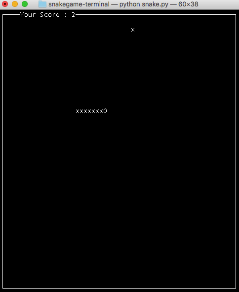

# Terminal snake game
A simple snake game right in your terminal using python built-in `curses` package.

## Run a terminal snake game
Run script from the root directory of the project:
```bash
~ python snake.py
```

## Demo


## Run unittests
Run script from the root directory of the project:
```bash
~ pytest -s -v
```

## Contributing

- clone the repository
- configure Git for the first time after cloning with your name and email
  ```bash
  git config --local user.name "Volodymyr Yahello"
  git config --local user.email "vyahello@gmail.com"
  ```
- `python3.6` is required to run the code