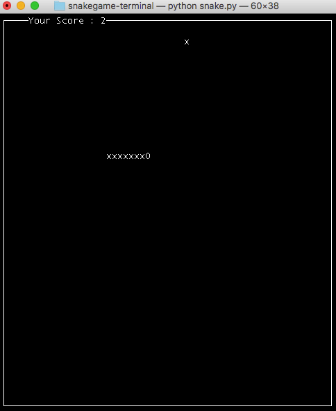

[](https://www.python.org/)
[](https://github.com/vyahello/snakegame-cli/releases)
[](https://travis-ci.org/vyahello/snakegame-cli)
[](https://img.shields.io/badge/coverage-56%25-orange)

[](https://github.com/vyahello/snakegame-cli/network/members)
[](https://github.com/vyahello/snakegame-cli/stargazers)
[](https://GitHub.com/vyahello/snakegame-cli/graphs/watchers/)
[](https://github.com/vyahello/snakegame-cli/issues)
[](https://GitHub.com/vyahello/snakegame-cli/graphs/contributors/)

[](https://www.elegantobjects.org)
[](LICENSE.md)
[](https://hitsofcode.com/view/github/vyahello/nakegame-cli)

[](https://pypi.python.org/pypi/cli-snakegame/)
[](https://pypi.python.org/pypi/cli-snakegame/)


# Terminal snake game
> A simple snake game right in your terminal using python built-in `curses` package.
> Just try it, it is fun :)

## Tools/features
 - python 3.6, 3.7, 3.8
 - curses
 - pytest
 - shell
 - travis CI
 - PYPI distributed

## Usage
Please run following script to obtain latest package from PYPI:
```bash
➜ pip install cli-snakegame
```
Then please execute instructions below to launch game from your environment:
```python
from snake.game import Game, SnakeGame

game: Game = SnakeGame()
game.run()
...
```

### Demo


## Development notes
### Run code analysis
In general static code analysis consists of following tools: `black`, `flake8`, `pylint`, `mypy` and `unittests` accordingly.
To be able to start static code analysis **locally** please run following script from the root directory of the project:
```bash
➜ ./analyse-code.sh install-dependencies
```
Anyway, this script is triggered via `Travis CI`.

### Run unittests
Also you can run unittests separately. Please run script from the root directory of the project:
```bash
➜ pytest
```
After please open `test-report.html` file to see detailed testing report

### Release notes

* 1.0.0
    * Introduce PYPI package
* 0.2.0
    * Add navigation options
* 0.1.0
    * Introduce initial app version

### Meta
Author – Volodymyr Yahello vyahello@gmail.com

Distributed under the `GNU` license. See [LICENSE](LICENSE.md) for more information.

You can reach out me at:
* [https://github.com/vyahello](https://github.com/vyahello)
* [https://www.linkedin.com/in/volodymyr-yahello-821746127](https://www.linkedin.com/in/volodymyr-yahello-821746127)

### Contributing
1. clone the repository
2. configure Git for the first time after cloning with your `name` and `email`
3. `pip install -r requirements.txt` to install all project dependencies
4. `pip install -r requirements-dev.txt` to install all project development dependencies
